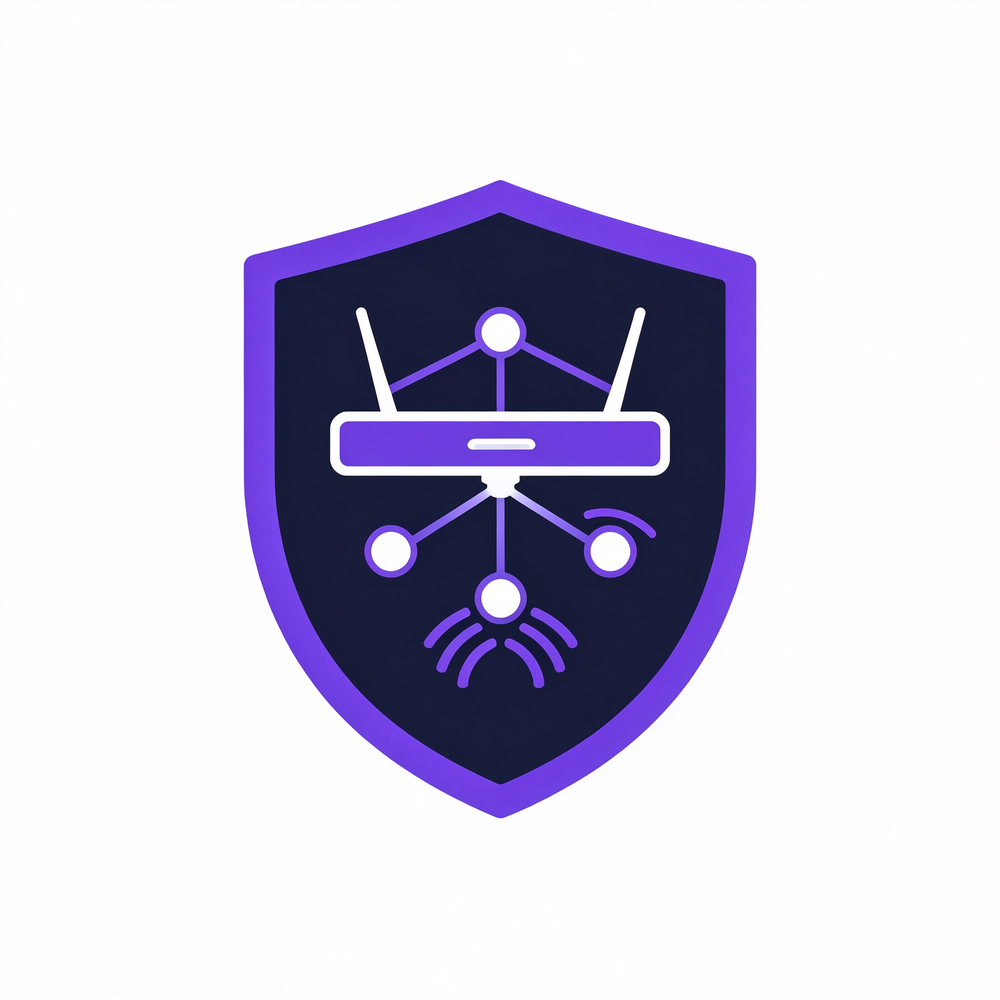

<p align="center">
  
</p>

# iStoreOS Tailscale 远程访问配置指南

在 iStoreOS (OpenWrt 24.10 x86_64) 上通过 Tailscale 实现安全远程访问 LuCI 后台。

不需要公网 IP，不需要 IPv6，不需要端口转发，在任何网络环境下都能连回家。

## 环境信息

| 项目 | 信息 |
|------|------|
| 系统 | iStoreOS 24.10.8 (OpenWrt) |
| 架构 | x86_64 |
| 包管理 | opkg |
| 路由器 IP | 192.168.100.1 |
| Tailscale 版本 | 1.80.3-r1 |

---

## 一、路由器端安装

### 一键安装（推荐）

SSH 或 Web 终端 (ttyd) 登录路由器后，直接运行：

```bash
wget https://raw.githubusercontent.com/georgezhou2024/Tailscale/main/tailscale-setup.sh
sh tailscale-setup.sh
```

脚本自动完成：安装 Tailscale → 启动服务 → 配置防火墙放行 80/2026 端口 → 生成登录链接。
跟着提示在浏览器打开链接授权即可。

---

### 手动安装

SSH 或 Web 终端 (ttyd，地址 `http://192.168.100.1:7681`) 登录路由器后执行：

```bash
opkg update
opkg install tailscale
```

> 如果官方源没有，可添加 Tailscale 官方源：
> ```bash
> cd /tmp
> curl -LO https://pkgs.tailscale.com/stable/opkg-repo-key.gpg
> opkg-key add opkg-repo-key.gpg
> echo "src/gz tailscale https://pkgs.tailscale.com/stable/openwrt-24.10/x86_64" >> /etc/opkg/customfeeds.conf
> opkg update
> opkg install tailscale
> ```

#### 启动 Tailscale 服务

```bash
/etc/init.d/tailscale enable
/etc/init.d/tailscale start
```

#### 登录授权

```bash
tailscale up --hostname=iStoreOS --accept-routes
```

终端会输出一个登录链接：

```
To authenticate, visit:
    https://login.tailscale.com/a/xxxxxxxxxxxx
```

在浏览器打开这个链接，用 Google/GitHub/微软账号登录 Tailscale，点 **Connect** 授权。

看到 **Login successful** 页面就说明路由器已加入网络。

### 查看路由器 Tailscale IP

```bash
tailscale ip -4
```

输出类似 `100.x.x.x`，记下来，以后用这个地址访问路由器。

---

## 二、防火墙配置（关键！不做这步网页打不开）

放行 80 端口（LuCI）和 2026 端口（Open-Box 面板）：

```bash
# 放行 80 端口（LuCI 后台）
uci add firewall rule
uci set firewall.@rule[-1].name='Allow-Tailscale-HTTP'
uci set firewall.@rule[-1].src='*'
uci set firewall.@rule[-1].dest_port='80'
uci set firewall.@rule[-1].proto='tcp'
uci set firewall.@rule[-1].target='ACCEPT'

# 放行 2026 端口（Open-Box 面板）
uci add firewall rule
uci set firewall.@rule[-1].name='Allow-Tailscale-2026'
uci set firewall.@rule[-1].src='*'
uci set firewall.@rule[-1].dest_port='2026'
uci set firewall.@rule[-1].proto='tcp'
uci set firewall.@rule[-1].target='ACCEPT'

uci commit firewall
/etc/init.d/firewall restart
```

---

## 三、手机端设置

### 苹果手机 (iPhone)

1. App Store 搜索 **Tailscale** 下载安装
2. 打开 App，登录同一个 Tailscale 账号
3. 弹窗请求 VPN 权限，点 **允许**
4. 确认开关是 **Connected**（蓝色）
5. 打开 Safari，输入 `http://100.x.x.x:2026`（Open-Box 面板）
6. 输入密码即可管理

### 安卓手机

1. 应用商店搜索 **Tailscale** 下载安装
2. 打开 App，登录同一个 Tailscale 账号
3. 允许 VPN 连接权限
4. 确认开关是 **Connected**
5. 打开浏览器，输入 `http://100.x.x.x:2026`

---

## 四、电脑端设置

### Windows

1. 打开 https://tailscale.com/download/windows 下载安装
2. 登录同一个 Tailscale 账号
3. 系统托盘出现 Tailscale 图标，确认已连接
4. 浏览器输入 `http://100.x.x.x:2026`

### Mac

1. 打开 App Store 搜索 **Tailscale** 安装
2. 登录同一个账号
3. 浏览器输入 `http://100.x.x.x:2026`

---

## 五、添加新设备

1. 在新设备上安装 Tailscale 客户端
2. 登录同一个 Tailscale 账号
3. 自动加入网络，不需要在路由器上做任何操作
4. 在手机/电脑上用 `http://100.x.x.x:2026` 访问 Open-Box 面板

> 注意：免费版最多 3 台设备。

---

## 六、删除设备

1. 打开 https://login.tailscale.com/admin/machines
2. 找到要删除的设备
3. 点右边 `...` → **Remove**
4. 确认删除

删除后该设备就不能再连回你的路由器了。

---

## 常见问题

### 登录成功但网页打不开

```bash
# 确认 tailscale0 接口存在
ip addr show tailscale0

# 确认 uhttpd 监听所有接口
netstat -tlnp | grep :80
# 应该看到 0.0.0.0:80

# 从路由器本机测试
curl -sI http://100.x.x.x
# 应该返回 200 OK
```

### 手机显示 Connected 但访问不了

- 确认浏览器输入的是 `http://` 不是 `https://`
- 在路由器终端执行 `tailscale status` 看手机是否显示 **active**
- 如果显示 **idle/offline**，把手机 Tailscale App 关掉重开

### 不需要公网 IP / IPv6

Tailscale 自动打洞，打不通就走中继服务器，任何网络环境都能用。

---

## 相关项目

- [luci-app-ups-manager](https://github.com/liuyuhao1023/luci-app-ups-manager) — UPS 电源管理插件
- [Tailscale 官网](https://tailscale.com)
